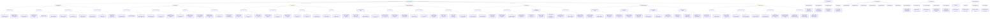

```mermaid
flowchart TD
    A[Student Profile AI Features] --> B[Learning Analytics]
    A --> C[Skill Assessment]
    A --> D[Career Guidance]
    A --> E[Content Recommendations]
    A --> F[Social Intelligence]
    A --> G[Achievement Recognition]
    A --> H[Personalization Engine]

    %% Learning Analytics Branch
    B --> B1[Learning Style Analysis]
    B --> B2[Progress Tracking]
    B --> B3[Performance Prediction]
    B --> B4[Study Pattern Recognition]
    
    B1 --> B1a[Requirements: User education history, skills data, time spent learning]
    B1 --> B1b[AI Model: Classification algorithm to determine visual/auditory/kinesthetic preferences]
    B1 --> B1c[Output: Personalized learning recommendations, study methods]
    
    B2 --> B2a[Requirements: Course completion data, skill proficiency levels, time tracking]
    B2 --> B2b[AI Model: Time series analysis, trend detection]
    B2 --> B2c[Output: Progress charts, milestone predictions, improvement suggestions]
    
    B3 --> B3a[Requirements: Historical performance, current skills, learning patterns]
    B3 --> B3b[AI Model: Predictive ML model using regression/neural networks]
    B3 --> B3c[Output: Success probability for courses, career paths, skill development]
    
    B4 --> B4a[Requirements: Login patterns, study session data, engagement metrics]
    B4 --> B4b[AI Model: Pattern recognition, clustering algorithms]
    B4 --> B4c[Output: Optimal study schedules, break recommendations, productivity insights]

    %% Skill Assessment Branch
    C --> C1[AI-Powered Skill Testing]
    C --> C2[Competency Gap Analysis]
    C --> C3[Skill Validation]
    C --> C4[Dynamic Skill Mapping]
    
    C1 --> C1a[Requirements: Question bank, adaptive testing framework, skill taxonomy]
    C1 --> C1b[AI Model: Item Response Theory, adaptive algorithms]
    C1 --> C1c[Output: Accurate skill levels, personalized test difficulty, certification scores]
    
    C2 --> C2a[Requirements: Current skills, target career goals, industry requirements]
    C2 --> C2b[AI Model: Graph neural networks, skill relationship mapping]
    C2 --> C2c[Output: Skill gap identification, learning path recommendations, priority rankings]
    
    C3 --> C3a[Requirements: Portfolio projects, code repositories, work samples]
    C3 --> C3b[AI Model: NLP for text analysis, computer vision for visual work, code analysis]
    C3 --> C3c[Output: Skill verification scores, portfolio quality assessment, improvement suggestions]
    
    C4 --> C4a[Requirements: Industry skill demands, emerging technologies, job market data]
    C4 --> C4b[AI Model: Market analysis, trend prediction, skill clustering]
    C4 --> C4c[Output: Future-ready skill recommendations, emerging skill alerts, market alignment scores]

    %% Career Guidance Branch
    D --> D1[Career Path Prediction]
    D --> D2[Industry Trend Analysis]
    D --> D3[Salary Prediction]
    D --> D4[Job Matching]
    
    D1 --> D1a[Requirements: Skills, interests, education, personality type, career goals]
    D1 --> D1b[AI Model: Multi-class classification, ensemble methods]
    D1 --> D1c[Output: Top career matches, probability scores, career progression paths]
    
    D2 --> D2a[Requirements: Industry data feeds, job posting analysis, economic indicators]
    D2 --> D2b[AI Model: NLP for job trend analysis, time series forecasting]
    D2 --> D2c[Output: Industry growth predictions, emerging roles, skill demand forecasts]
    
    D3 --> D3a[Requirements: Skills, location, experience level, industry data]
    D3 --> D3b[AI Model: Regression models, market analysis algorithms]
    D3 --> D3c[Output: Salary ranges, earning potential, geographical comparisons]
    
    D4 --> D4a[Requirements: Student profile, job descriptions, company data]
    D4 --> D4b[AI Model: Similarity matching, NLP for requirement analysis]
    D4 --> D4c[Output: Job compatibility scores, application recommendations, skill alignment]

    %% Content Recommendations Branch
    E --> E1[Personalized Learning Content]
    E --> E2[Mentor Matching]
    E --> E3[Course Recommendations]
    E --> E4[Resource Discovery]
    
    E1 --> E1a[Requirements: Learning preferences, current knowledge, goals, engagement history]
    E1 --> E1b[AI Model: Collaborative filtering, content-based filtering, hybrid approaches]
    E1 --> E1c[Output: Curated articles, videos, tutorials, practice exercises]
    
    E2 --> E2a[Requirements: Student profile, mentor expertise, personality compatibility, goals]
    E2 --> E2b[AI Model: Similarity algorithms, personality matching, success prediction]
    E2 --> E2c[Output: Top mentor matches, compatibility scores, mentorship success probability]
    
    E3 --> E3a[Requirements: Current skills, career goals, learning history, peer data]
    E3 --> E3b[AI Model: Recommender systems, collaborative filtering]
    E3 --> E3c[Output: Course suggestions, difficulty matching, completion probability]
    
    E4 --> E4a[Requirements: Search behavior, content interaction, learning objectives]
    E4 --> E4b[AI Model: Semantic search, content understanding, user behavior analysis]
    E4 --> E4c[Output: Relevant resources, tools, platforms, learning materials]

    %% Social Intelligence Branch
    F --> F1[Peer Network Analysis]
    F --> F2[Study Group Formation]
    F --> F3[Collaboration Recommendations]
    F --> F4[Communication Insights]
    
    F1 --> F1a[Requirements: Social connections, interaction patterns, shared interests]
    F1 --> F1b[AI Model: Graph analysis, social network algorithms, influence measurement]
    F1 --> F1c[Output: Network strength scores, influential connections, expansion opportunities]
    
    F2 --> F2a[Requirements: Student profiles, learning goals, compatibility factors, schedules]
    F2 --> F2b[AI Model: Clustering algorithms, compatibility matching, group dynamics]
    F2 --> F2c[Output: Optimal study group suggestions, role assignments, success predictions]
    
    F3 --> F3a[Requirements: Project history, skill complementarity, working styles]
    F3 --> F3b[AI Model: Team formation algorithms, skill gap analysis, personality matching]
    F3 --> F3c[Output: Collaboration partner suggestions, project team recommendations, success probability]
    
    F4 --> F4a[Requirements: Communication patterns, feedback data, interaction quality]
    F4 --> F4b[AI Model: NLP sentiment analysis, communication pattern recognition]
    F4 --> F4c[Output: Communication style insights, improvement suggestions, relationship quality scores]

    %% Achievement Recognition Branch
    G --> G1[Automated Achievement Detection]
    G --> G2[Micro-Credential Generation]
    G --> G3[Progress Milestone Recognition]
    G --> G4[Skill Endorsement Validation]
    
    G1 --> G1a[Requirements: Activity logs, project submissions, assessment results, portfolio updates]
    G1 --> G1b[AI Model: Event detection, pattern recognition, achievement classification]
    G1 --> G1c[Output: Automatic badge awards, achievement notifications, progress celebrations]
    
    G2 --> G2a[Requirements: Skill demonstrations, project completions, assessment scores]
    G2 --> G2b[AI Model: Competency verification, blockchain for credentials, quality assessment]
    G2 --> G2c[Output: Digital badges, skill certificates, verifiable credentials, portfolio enhancements]
    
    G3 --> G3a[Requirements: Learning objectives, progress tracking, timeline data]
    G3 --> G3b[AI Model: Milestone detection, progress analysis, goal tracking]
    G3 --> G3c[Output: Milestone celebrations, progress visualizations, motivation boosters]
    
    G4 --> G4a[Requirements: Peer endorsements, work samples, skill demonstrations]
    G4 --> G4b[AI Model: Credibility scoring, validation algorithms, peer assessment analysis]
    G4 --> G4c[Output: Endorsement authenticity scores, skill credibility ratings, reputation management]

    %% Personalization Engine Branch
    H --> H1[Adaptive UI/UX]
    H --> H2[Learning Path Optimization]
    H --> H3[Goal Setting Assistance]
    H --> H4[Motivational Intelligence]
    
    H1 --> H1a[Requirements: User behavior, preferences, accessibility needs, device usage]
    H1 --> H1b[AI Model: User behavior analysis, A/B testing, preference learning]
    H1 --> H1c[Output: Personalized dashboard, adaptive interface, accessibility optimizations]
    
    H2 --> H2a[Requirements: Current skills, target goals, learning speed, available time]
    H2 --> H2b[AI Model: Path optimization algorithms, reinforcement learning, success prediction]
    H2 --> H2c[Output: Optimized learning sequences, time estimates, difficulty progression]
    
    H3 --> H3a[Requirements: Current status, interests, market trends, personal aspirations]
    H3 --> H3b[AI Model: Goal recommendation, SMART goal framework, feasibility analysis]
    H3 --> H3c[Output: Suggested goals, goal breakdowns, timeline recommendations, success strategies]
    
    H4 --> H4a[Requirements: Engagement patterns, progress data, emotional indicators, success metrics]
    H4 --> H4b[AI Model: Motivational pattern recognition, engagement prediction, behavioral psychology]
    H4 --> H4c[Output: Personalized motivational messages, gamification elements, intervention triggers]

    %% Implementation Database Requirements
    I[Database Schema Extensions Needed] --> I1[Learning Analytics Tables]
    I --> I2[AI Model Results Tables]
    I --> I3[User Interaction Tracking]
    I --> I4[Content Metadata]
    
    I1 --> I1a[learning_sessions, study_patterns, progress_tracking, performance_metrics]
    I2 --> I2a[ai_predictions, skill_assessments, career_recommendations, personality_insights]
    I3 --> I3a[user_interactions, engagement_metrics, click_streams, learning_events]
    I4 --> I4a[content_ratings, resource_metadata, learning_objectives, difficulty_levels]

    %% API Endpoints Required
    J[New API Endpoints] --> J1["/api/ai/learning-analytics"]
    J --> J2["/api/ai/skill-assessment"]
    J --> J3["/api/ai/career-guidance"]
    J --> J4["/api/ai/recommendations"]
    J --> J5["/api/ai/social-intelligence"]
    J --> J6["/api/ai/achievements"]
    J --> J7["/api/ai/personalization"]

    %% Integration with Existing Features
    K[Integration Points] --> K1[Skills Canvas Enhancement]
    K --> K2[Goals Section AI Boost]
    K --> K3[About Section Intelligence]
    K --> K4[Achievement Timeline AI]
    K --> K5[Circle View AI Matching]
    
    K1 --> K1a[AI-powered skill gap analysis, proficiency validation, learning recommendations]
    K2 --> K2a[Smart goal suggestions, progress prediction, achievement likelihood]
    K3 --> K3a[Personality insights, career fit analysis, learning style identification]
    K4 --> K4a[Automated achievement detection, milestone recognition, progress celebrations]
    K5 --> K5a[AI-matched peer connections, mentor recommendations, study group formation]

    %% Technology Stack Requirements
    L[Technology Requirements] --> L1[Machine Learning Framework]
    L --> L2[Data Pipeline]
    L --> L3[Real-time Processing]
    L --> L4[Model Deployment]
    
    L1 --> L1a[Python/TensorFlow or Node.js/TensorFlow.js for ML models]
    L2 --> L2a[Data collection, cleaning, feature engineering, model training pipelines]
    L3 --> L3a[Stream processing for real-time recommendations and insights]
    L4 --> L4a[Model serving, A/B testing, performance monitoring, model updates]

    style A fill:#e1f5fe
    style B fill:#f3e5f5
    style C fill:#e8f5e8
    style D fill:#fff3e0
    style E fill:#fce4ec
    style F fill:#f1f8e9
    style G fill:#e0f2f1
    style H fill:#f9fbe7
```
