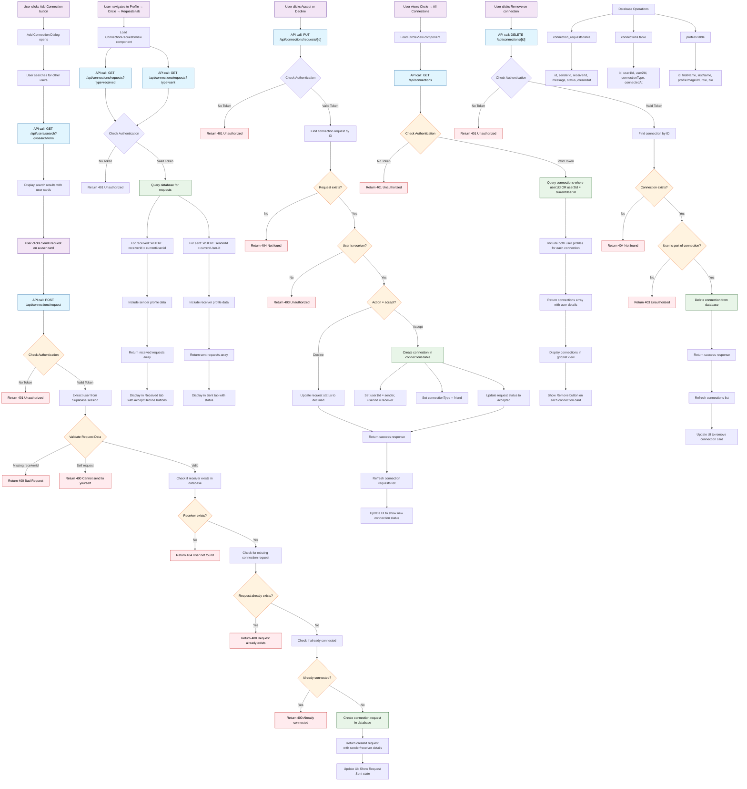

## Connection Request Flow Overview

This flowchart shows the complete connection request system with the following key components:

### 1. **Connection Request Creation**
- User searches for other users via `/api/users/search`
- Sends connection request via `POST /api/connections/request`
- System validates authentication, checks for duplicates, and creates request

### 2. **Viewing Requests**
- Users can view received and sent requests via `/api/connections/requests`
- Requests are displayed in tabs with appropriate actions

### 3. **Responding to Requests**
- Receivers can accept/decline via `PUT /api/connections/requests/[id]`
- Accepting creates a new connection in the `connections` table
- Declining updates request status

### 4. **Managing Connections**
- Users view connections via `GET /api/connections`
- Can remove connections via `DELETE /api/connections/[id]`
- UI updates automatically after actions

### 5. **Database Tables**
- `connection_requests`: Stores pending/processed requests
- `connections`: Stores established connections
- `profiles`: User profile information for display

### 6. **Authentication & Authorization**
- All endpoints verify Supabase session tokens
- Users can only modify their own requests/connections
- Proper error handling for unauthorized access
