# PathPiper Integrated Tables - Detailed Flow with Pages and Operations

This diagram shows the exact flow of how integrated tables are used across the platform, including specific pages and operations.

```mermaid
flowchart TD
    %% Authentication Flow
    A[User Authentication] --> A1[Supabase Auth]
    A1 --> A2[auth-service.ts registerStudent]
    A2 --> A3[prisma.profile.create → profiles table]
    A3 --> A4[prisma.studentProfile.create → student_profiles table]
    
    A1 --> A5[auth-service.ts registerMentor]
    A5 --> A6[prisma.profile.create → profiles table]
    A6 --> A7[prisma.mentorProfile.create → mentor_profiles table]
    
    A1 --> A8[auth-service.ts registerInstitution]
    A8 --> A9[prisma.profile.create → profiles table]
    A9 --> A10[prisma.institutionProfile.create → institution_profiles table]
    
    %% Profile Management Flow
    B[Profile Pages] --> B1["/student/profile/edit"]
    B1 --> B2[ProfileEditForm Component]
    B2 --> B3[personal-info-form.tsx]
    B3 --> B4["/api/profile/personal-info"]
    B4 --> B5[profiles table + student_profiles table updates]
    
    B2 --> B6[social-contact-form.tsx]
    B6 --> B7["/api/profile/social-contact"]
    B7 --> B8[social_links table operations + profiles table email/phone]
    
    %% Education History Flow
    C[Education Management] --> C1[education-history-form.tsx]
    C1 --> C2["/api/education POST/PUT/DELETE"]
    C2 --> C3[student_education_history table CRUD]
    C3 --> C4[institution_types + institution_categories tables read]
    
    %% Institution Types Flow
    D[Institution Management] --> D1["/api/institution-types GET"]
    D1 --> D2[institution_types + institution_categories tables read]
    D2 --> D3[Used in education forms for dropdowns]
    D3 --> D4[getPlaceholdersForType function]
    
    %% Skills & Interests Flow
    E[Skills Management] --> E1[skills-abilities-form.tsx]
    E1 --> E2["/api/skills GET"]
    E2 --> E3[skills + skill_categories tables read]
    E3 --> E4["/api/user/skills POST/DELETE"]
    E4 --> E5[user_skills table create/delete operations]
    
    F[Interests Management] --> F1[interests-passions-form.tsx]
    F1 --> F2["/api/interests GET"]
    F2 --> F3[interests + interest_categories tables read]
    F3 --> F4["/api/user/interests POST/DELETE"]
    F4 --> F5[user_interests table create/delete operations]
    
    %% Goals Flow
    G[Goals Management] --> G1[goals-aspirations-form.tsx]
    G1 --> G2["/api/goals POST/PUT/DELETE"]
    G2 --> G3[career_goals table CRUD operations]
    
    %% Profile Viewing Flow
    H[Profile Display] --> H1["/student/profile/[handle]"]
    H1 --> H2["/api/student/profile/[id] GET"]
    H2 --> H3[Multi-table JOIN query]
    H3 --> H4[student_profiles table with includes]
    H4 --> H5[JOIN: profiles + student_education_history + user_interests + user_skills + social_links + career_goals tables]
    
    %% Status Monitoring
    I[System Status] --> I1["/status page"]
    I1 --> I2["/api/status GET"]
    I2 --> I3[profiles table count for health check]
    
    %% Mood Board Flow
    J[Mood Board] --> J1[mood-board-media-form.tsx]
    J1 --> J2[mood_board table operations]
    
    %% Detailed Operation Breakdowns
    K[Detailed Operations] --> K1[Profile Operations]
    K1 --> K1a[profiles table SELECT with JOINs to student_profiles/mentor_profiles/institution_profiles]
    K1 --> K1b[profiles table UPDATE with filtered data]
    K1 --> K1c[student_profiles table UPDATE with enum casting]
    
    K --> K2[Social Links Operations]
    K2 --> K2a[social_links table SELECT WHERE user_id]
    K2 --> K2b[social_links table DELETE + INSERT batch operations]
    K2 --> K2c[social_links table UPSERT with user_id + platform constraint]
    
    K --> K3[Education Operations]
    K3 --> K3a[student_education_history table INSERT with institution_types FK]
    K3 --> K3b[student_education_history table UPDATE WHERE id]
    K3 --> K3c[student_education_history table DELETE WHERE id]
    K3 --> K3d[student_education_history JOIN institution_types JOIN institution_categories]
    
    K --> K4[Skills Operations]
    K4 --> K4a[skills table SELECT JOIN skill_categories GROUP BY category]
    K4 --> K4b[user_skills table SELECT JOIN skills WHERE user_id]
    K4 --> K4c[user_skills table INSERT with proficiency_level]
    K4 --> K4d[user_skills table DELETE WHERE user_id AND skill_id]
    
    K --> K5[Interest Operations]
    K5 --> K5a[interests table SELECT JOIN interest_categories]
    K5 --> K5b[user_interests table SELECT JOIN interests WHERE user_id]
    K5 --> K5c[user_interests table INSERT]
    K5 --> K5d[user_interests table DELETE WHERE user_id AND interest_id]
    
    K --> K6[Goal Operations]
    K6 --> K6a[career_goals table INSERT with user_id]
    K6 --> K6b[career_goals table UPDATE WHERE id]
    K6 --> K6c[career_goals table DELETE WHERE id]
    K6 --> K6d[career_goals table SELECT WHERE user_id ORDER BY created_at DESC]
    
    %% Data Flow Integration
    L[Data Integration Points] --> L1[Registration Flow]
    L1 --> L1a[Supabase auth.users table INSERT]
    L1a --> L1b[profiles table INSERT with matching UUID]
    L1b --> L1c[student_profiles/mentor_profiles/institution_profiles table INSERT]
    
    L --> L2[Profile Edit Flow]
    L2 --> L2a[Forms collect data]
    L2a --> L2b[API endpoints validate and process]
    L2b --> L2c[UPDATE profiles + student_profiles + social_links tables]
    
    L --> L3[Profile View Flow]
    L3 --> L3a[Single API call fetches all related data]
    L3a --> L3b[Complex JOINs: profiles + student_profiles + student_education_history + user_interests + user_skills + social_links + career_goals]
    L3b --> L3c[Formatted response with nested relationships]
    
    %% Error Handling & Transactions
    M[Error Handling] --> M1[try-catch blocks in API routes]
    M1 --> M2[Prisma error handling]
    M2 --> M3[Rollback on transaction failures]
    
    %% Security & Access Control
    N[Security Layer] --> N1[Supabase Auth token verification]
    N1 --> N2[User ID matching for profile access]
    N2 --> N3[Row Level Security on all tables + WHERE user_id filters]
    
    %% Styling
    classDef authFlow fill:#e1f5fe
    classDef profileFlow fill:#f3e5f5
    classDef dataFlow fill:#e8f5e8
    classDef operationFlow fill:#fff3e0
    classDef securityFlow fill:#ffebee
    
    class A,A1,A2,A3,A4,A5,A6,A7,A8,A9,A10 authFlow
    class B,B1,B2,B3,B4,B5,B6,B7,B8,H,H1,H2,H3,H4,H5 profileFlow
    class C,C1,C2,C3,C4,D,D1,D2,D3,D4,E,E1,E2,E3,E4,E5,F,F1,F2,F3,F4,F5,G,G1,G2,G3,J,J1,J2 dataFlow
    class K,K1,K1a,K1b,K1c,K2,K2a,K2b,K2c,K3,K3a,K3b,K3c,K3d,K4,K4a,K4b,K4c,K4d,K5,K5a,K5b,K5c,K5d,K6,K6a,K6b,K6c,K6d operationFlow
    class N,N1,N2,N3,M,M1,M2,M3 securityFlow
```

## Key Integration Points

### 1. **Authentication to Profile Creation**
- `auth-service.ts` → Supabase Auth → Prisma Profile Creation
- Same UUID used across Supabase and Prisma
- Role-specific profile creation (student/mentor/institution)

### 2. **Profile Edit Form Integration**
- `ProfileEditForm` → Multiple sub-forms → Specific API endpoints → Prisma operations
- Real-time updates across multiple tables
- Form state management with immediate persistence

### 3. **Education History Management**
- `education-history-form.tsx` → Institution type lookups → Education record CRUD
- Complex relationships with institution types and categories
- Dynamic placeholder text based on institution types

### 4. **Skills & Interests System**
- Age-appropriate content filtering
- Many-to-many relationships through junction tables
- Category-based organization

### 5. **Profile Viewing Optimization**
- Single API call with complex includes
- Nested relationship fetching
- Formatted response structure

### 6. **Data Consistency & Security**
- User ID validation at every API endpoint
- Prisma transactions for multi-table operations
- Error handling with rollback capabilities

This flow shows how Prisma serves as the central data layer, handling complex relationships and ensuring data consistency across the entire PathPiper platform.
