# Prisma Usage Flow in PathPiper Platform

```mermaid
graph TD
    A[User Registration/Login Request] --> B{Authentication Type}
    
    B -->|Registration| C[Supabase Auth Creates User]
    B -->|Login| D[Supabase Auth Validates User]
    B -->|Social Login| E[OAuth Provider + Supabase]
    
    C --> F[Prisma: Create Profile Record]
    F --> G{User Role}
    
    G -->|Student| H[Prisma: Create StudentProfile]
    G -->|Mentor| I[Prisma: Create MentorProfile] 
    G -->|Institution| J[Prisma: Create InstitutionProfile]
    
    D --> K[Prisma: Fetch User Profile]
    E --> L[Prisma: Check/Create Profile]
    
    K --> M[Profile Data Retrieved]
    H --> N[Student Registration Complete]
    I --> O[Mentor Registration Complete]
    J --> P[Institution Registration Complete]
    L --> Q{Profile Exists?}
    
    Q -->|No| F
    Q -->|Yes| M
    
    M --> R[User Dashboard/Profile Pages]
    N --> S[Student Onboarding Flow]
    O --> T[Mentor Onboarding Flow]
    P --> U[Institution Onboarding Flow]
    
    R --> V[Profile Operations]
    S --> W[Student-Specific Operations]
    T --> X[Mentor-Specific Operations]
    U --> Y[Institution-Specific Operations]
    
    V --> V1[Update Profile Info]
    V --> V2[Manage Social Links]
    V --> V3[Update Contact Info]
    V --> V4[Profile Image Upload]
    
    W --> W1[Education History Management]
    W --> W2[Skills & Interests]
    W --> W3[Career Goals]
    W --> W4[Mood Board]
    
    X --> X1[Mentor Availability]
    X --> X2[Experience & Expertise]
    X --> X3[Mentorship Settings]
    
    Y --> Y1[Institution Details]
    Y --> Y2[Programs & Courses]
    Y --> Y3[Verification Status]
    
    V1 --> Z1[prisma.profile.update]
    V2 --> Z2[prisma.socialLink.upsert/delete]
    V3 --> Z3[prisma.profile.update]
    V4 --> Z4[prisma.profile.update profileImageUrl]
    
    W1 --> Z5[prisma.studentEducationHistory.create/update]
    W2 --> Z6[prisma.userInterest.create + prisma.userSkill.create]
    W3 --> Z7[prisma.careerGoal.create/update]
    W4 --> Z8[prisma.moodBoard.create/update]
    
    X1 --> Z9[prisma.mentorProfile.update]
    X2 --> Z10[prisma.mentorProfile.update]
    X3 --> Z11[prisma.mentorProfile.update]
    
    Y1 --> Z12[prisma.institutionProfile.update]
    Y2 --> Z13[prisma.institutionProfile.update]
    Y3 --> Z14[prisma.institutionProfile.update verified]
    
    AA[API Endpoints] --> BB[Database Operations]
    
    BB --> BB1["API: /profile/personal-info"]
    BB --> BB2["API: /profile/social-contact"]
    BB --> BB3["API: /education"]
    BB --> BB4["API: /interests"]
    BB --> BB5["API: /skills"]
    BB --> BB6["API: /goals"]
    BB --> BB7["API: /student/profile/[id]"]
    BB --> BB8["API: /institution-types"]
    
    BB1 --> CC1[prisma.profile.update + prisma.studentProfile.update]
    BB2 --> CC2[prisma.socialLink operations]
    BB3 --> CC3[prisma.studentEducationHistory operations]
    BB4 --> CC4[prisma.userInterest operations]
    BB5 --> CC5[prisma.userSkill operations]
    BB6 --> CC6[prisma.careerGoal operations]
    BB7 --> CC7[prisma.profile.findUnique with includes]
    BB8 --> CC8[prisma.institutionCategory.findMany]
    
    DD[Database Connection] --> EE[Prisma Client Instance]
    EE --> FF[lib/prisma.ts]
    FF --> GG[Singleton Pattern]
    GG --> HH[Connection Pooling]
    
    II[Status Monitoring] --> JJ["API: /status"]
    JJ --> KK[prisma.profile.count]
    
    LL[Profile Queries] --> MM[Complex Includes]
    MM --> NN[student: true, mentor: true, institution: true]
    
    OO[Education History] --> PP[Institution Type Relationships]
    PP --> QQ[prisma.institutionType.findMany]
    QQ --> RR[Category Hierarchies]
    
    SS[Data Validation] --> TT[Prisma Schema Constraints]
    TT --> UU[Enum Validations]
    UU --> VV[UserRole, AgeGroup, EducationLevel]
    
    WW[File Upload Handling] --> XX[Profile/Cover Images]
    XX --> YY[prisma.profile.update with URLs]
    
    ZZ[Connection Management] --> AAA[Authentication Check]
    AAA --> BBB[Profile Data Fetch]
    BBB --> CCC[Role-Based Redirects]
    
    DDD[Error Handling] --> EEE[Prisma Error Catching]
    EEE --> FFF[Database Connection Failures]
    FFF --> GGG[Graceful Degradation]

    style A fill:#e1f5fe
    style C fill:#fff3e0
    style F fill:#f3e5f5
    style Z1 fill:#e8f5e8
    style Z2 fill:#e8f5e8
    style Z5 fill:#e8f5e8
    style Z6 fill:#e8f5e8
    style CC1 fill:#fff9c4
    style CC2 fill:#fff9c4
    style EE fill:#ffebee
    style FF fill:#ffebee
```

## Key Prisma Usage Patterns in PathPiper:

### 1. **Authentication Flow**
- **Supabase** handles auth, **Prisma** handles profile data
- ID synchronization between systems
- Profile creation after successful auth

### 2. **Profile Management**
- `prisma.profile.update()` - Basic profile info
- `prisma.studentProfile.update()` - Student-specific fields
- `prisma.socialLink.upsert()` - Social media links

### 3. **Education History**
- `prisma.studentEducationHistory.create()` - Add education records
- `prisma.institutionType.findMany()` - Institution type relationships

### 4. **Skills & Interests**
- `prisma.userInterest.create()` - User interests
- `prisma.userSkill.create()` - User skills with proficiency

### 5. **Connection Management**
- Database connection singleton in `lib/prisma.ts`
- Connection pooling and query optimization
- Error handling and graceful degradation

### 6. **API Endpoints**
- All API routes use Prisma for database operations
- Complex queries with includes for related data
- Type-safe operations with generated Prisma client

### 7. **Status Monitoring**
- Health checks via `prisma.profile.count()`
- Connection status validation
- Database availability monitoring
