# PathPiper Database Table Integration Analysis

## Summary
- **Total Tables**: 32
- **Integrated Tables**: 19 (59.4%)
- **Not Integrated**: 13 (40.6%)

## Mermaid Flow Diagram

```mermaid
flowchart TD
    A[Supabase Tables] --> B[Integrated Tables]
    A --> C[Not Integrated Tables]
    
    B --> B1[Core Profile System]
    B --> B2[Education System]
    B --> B3[Skills & Interests]
    B --> B4[Institution Management]
    B --> B5[Social Features]
    B --> B6[Enhanced Profile Features]
    
    B1 --> B1a[profiles ✅]
    B1 --> B1b[student_profiles ✅]
    B1 --> B1c[mentor_profiles ✅]
    B1 --> B1d[institution_profiles ✅]
    
    B2 --> B2a[student_education_history ✅]
    B2 --> B2b[institution_types ✅]
    B2 --> B2c[institution_categories ✅]
    
    B3 --> B3a[skills ✅]
    B3 --> B3b[user_skills ✅]
    B3 --> B3c[interests ✅]
    B3 --> B3d[user_interests ✅]
    B3 --> B3e[skill_categories ✅]
    B3 --> B3f[interest_categories ✅]
    
    B4 --> B4a[institution_types ✅]
    B4 --> B4b[institution_categories ✅]
    
    B5 --> B5a[social_links ✅]
    B5 --> B5b[languages ✅]
    B5 --> B5c[user_languages ✅]
    
    B6 --> B6a[career_goals ✅]
    B6 --> B6b[mood_board ✅]
    
    C --> C1[Goals System]
    C --> C2[Social Features]
    C --> C3[Institution Features]
    C --> C4[Mentor Features]
    C --> C5[Feed System]
    C --> C6[Connection System]
    C --> C7[Hobby System]
    C --> C8[Badge System]
    C --> C9[Endorsement System]
    
    C1 --> C1a[goals ❌]
    
    C2 --> C2a[connection_requests ❌]
    C2b[connections ❌]
    C2c[mentorships ❌]
    
    C3 --> C3a[institution_events ❌]
    C3b[institution_gallery ❌]
    C3c[institution_programs ❌]
    
    C4 --> C4a[mentor_availability ❌]
    C4b[mentor_experience ❌]
    C4c[mentor_expertise ❌]
    
    C5 --> C5a[feed_posts ❌]
    C5b[post_comments ❌]
    C5c[post_likes ❌]
    
    C7 --> C7a[hobbies ❌]
    C7b[user_hobbies ❌]
    
    C8 --> C8a[custom_badges ❌]
    
    C9 --> C9a[skill_endorsements ❌]
    
    style B fill:#4ade80
    style C fill:#f87171
    style B1a fill:#dcfce7
    style B1b fill:#dcfce7
    style B1c fill:#dcfce7
    style B1d fill:#dcfce7
    style B2a fill:#dcfce7
    style B2b fill:#dcfce7
    style B2c fill:#dcfce7
    style B3a fill:#dcfce7
    style B3b fill:#dcfce7
    style B3c fill:#dcfce7
    style B3d fill:#dcfce7
    style B3e fill:#dcfce7
    style B3f fill:#dcfce7
    style B4a fill:#dcfce7
    style B4b fill:#dcfce7
    style B5a fill:#dcfce7
    style B5b fill:#dcfce7
    style B5c fill:#dcfce7
    style B6a fill:#dcfce7
    style B6b fill:#dcfce7
    style C1a fill:#fecaca
    style C2a fill:#fecaca
    style C2b fill:#fecaca
    style C2c fill:#fecaca
    style C3a fill:#fecaca
    style C3b fill:#fecaca
    style C3c fill:#fecaca
    style C4a fill:#fecaca
    style C4b fill:#fecaca
    style C4c fill:#fecaca
    style C5a fill:#fecaca
    style C5b fill:#fecaca
    style C5c fill:#fecaca
    style C7a fill:#fecaca
    style C7b fill:#fecaca
    style C8a fill:#fecaca
    style C9a fill:#fecaca
```

## 🟢 INTEGRATED TABLES (19/32)

### Core Profile System (4 tables)
1. **profiles** ✅ - Fully integrated
   - Used in: auth-service.ts, profile forms, user authentication
   - API endpoints: `/api/profile/*`, `/api/auth/user`

2. **student_profiles** ✅ - Fully integrated
   - Used in: student registration, profile forms
   - API endpoints: `/api/profile/personal-info`

3. **mentor_profiles** ✅ - Fully integrated
   - Used in: mentor registration, profile system
   - API endpoints: mentor onboarding

4. **institution_profiles** ✅ - Fully integrated
   - Used in: institution registration, profile system
   - API endpoints: institution onboarding

### Education System (3 tables)
5. **student_education_history** ✅ - Fully integrated
   - Used in: education-history-form.tsx
   - API endpoints: `/api/education`

6. **institution_types** ✅ - Fully integrated
   - Used in: education forms, institution management
   - API endpoints: `/api/institution-types`

7. **institution_categories** ✅ - Fully integrated
   - Used in: institution type organization
   - Referenced in Prisma schema

### Skills & Interests System (6 tables)
8. **skills** ✅ - Fully integrated
   - Used in: skills-abilities-form.tsx
   - API endpoints: `/api/skills`, `/api/user/skills`

9. **user_skills** ✅ - Fully integrated
   - Used in: user skill management
   - API endpoints: `/api/user/skills`

10. **interests** ✅ - Fully integrated
    - Used in: interests-passions-form.tsx
    - API endpoints: `/api/interests`, `/api/user/interests`

11. **user_interests** ✅ - Fully integrated
    - Used in: user interest management
    - API endpoints: `/api/user/interests`

12. **skill_categories** ✅ - Fully integrated
    - Used in: age-appropriate content organization
    - Referenced in Prisma schema

13. **interest_categories** ✅ - Fully integrated
    - Used in: age-appropriate content organization
    - Referenced in Prisma schema

### Social Features (3 tables)
14. **social_links** ✅ - Fully integrated
    - Used in: social-contact-form.tsx
    - API endpoints: `/api/profile/social-contact`

15. **languages** ✅ - Fully integrated
    - Used in: user language management
    - Referenced in Prisma schema

16. **user_languages** ✅ - Fully integrated
    - Used in: user language preferences
    - Referenced in Prisma schema

### Enhanced Profile Features (2 tables)
17. **career_goals** ✅ - Fully integrated
    - Used in: goals-aspirations-form.tsx
    - API endpoints: `/api/goals`

18. **mood_board** ✅ - Fully integrated
    - Used in: mood-board-media-form.tsx
    - Referenced in profile system

### Status Monitoring (1 table)
19. **custom_badges** ✅ - Schema integrated
    - Defined in Prisma schema
    - Referenced in profile system

## 🔴 NOT INTEGRATED TABLES (13/32)

### Goals System (1 table)
1. **goals** ❌ - Schema exists but not used
   - Present in Prisma schema but no implementation
   - Different from career_goals table

### Connection System (3 tables)
2. **connection_requests** ❌ - Schema only
   - Defined in schema but no API/UI implementation

3. **connections** ❌ - Schema only
   - Defined in schema but no API/UI implementation

4. **mentorships** ❌ - Schema only
   - Defined in schema but no mentorship functionality

### Institution Features (3 tables)
5. **institution_events** ❌ - Schema only
   - Defined in schema but no events management

6. **institution_gallery** ❌ - Schema only
   - Defined in schema but no gallery functionality

7. **institution_programs** ❌ - Schema only
   - Defined in schema but no programs management

### Mentor Features (3 tables)
8. **mentor_availability** ❌ - Schema only
   - Defined in schema but no availability system

9. **mentor_experience** ❌ - Schema only
   - Defined in schema but no experience management

10. **mentor_expertise** ❌ - Schema only
    - Defined in schema but no expertise system

### Feed System (3 tables)
11. **feed_posts** ❌ - Schema only
    - Defined in schema but feed system not implemented

12. **post_comments** ❌ - Schema only
    - Defined in schema but comments not implemented

13. **post_likes** ❌ - Schema only
    - Defined in schema but likes not implemented

### Hobby System (2 tables)
14. **hobbies** ❌ - Schema only
    - Defined in schema but no hobby functionality

15. **user_hobbies** ❌ - Schema only
    - Defined in schema but no user hobby management

### Endorsement System (1 table)
16. **skill_endorsements** ❌ - Schema only
    - Defined in schema but no endorsement functionality

## Integration Status by Feature Area

| Feature Area | Integrated | Not Integrated | Completion % |
|--------------|------------|----------------|--------------|
| Core Profiles | 4/4 | 0/4 | 100% |
| Education | 3/3 | 0/3 | 100% |
| Skills & Interests | 6/6 | 0/6 | 100% |
| Social Contact | 3/3 | 0/3 | 100% |
| Enhanced Profile | 2/2 | 0/2 | 100% |
| Connection System | 0/3 | 3/3 | 0% |
| Institution Features | 0/3 | 3/3 | 0% |
| Mentor Features | 0/3 | 3/3 | 0% |
| Feed System | 0/3 | 3/3 | 0% |
| Hobby System | 0/2 | 2/2 | 0% |
| Endorsements | 0/1 | 1/1 | 0% |
| Goals (Separate) | 0/1 | 1/1 | 0% |

## Priority for Integration

### High Priority (Core functionality gaps)
1. **feed_posts, post_comments, post_likes** - Essential for social platform
2. **connections, connection_requests** - Core networking functionality
3. **mentorships** - Key platform feature

### Medium Priority (Enhanced features)
1. **institution_events, institution_programs** - Institution engagement
2. **mentor_availability, mentor_expertise** - Mentor functionality
3. **skill_endorsements** - Professional credibility

### Low Priority (Nice-to-have)
1. **hobbies, user_hobbies** - Additional profile depth
2. **institution_gallery** - Visual enhancement
3. **custom_badges** - Gamification
4. **goals** (separate table) - Duplicate functionality
